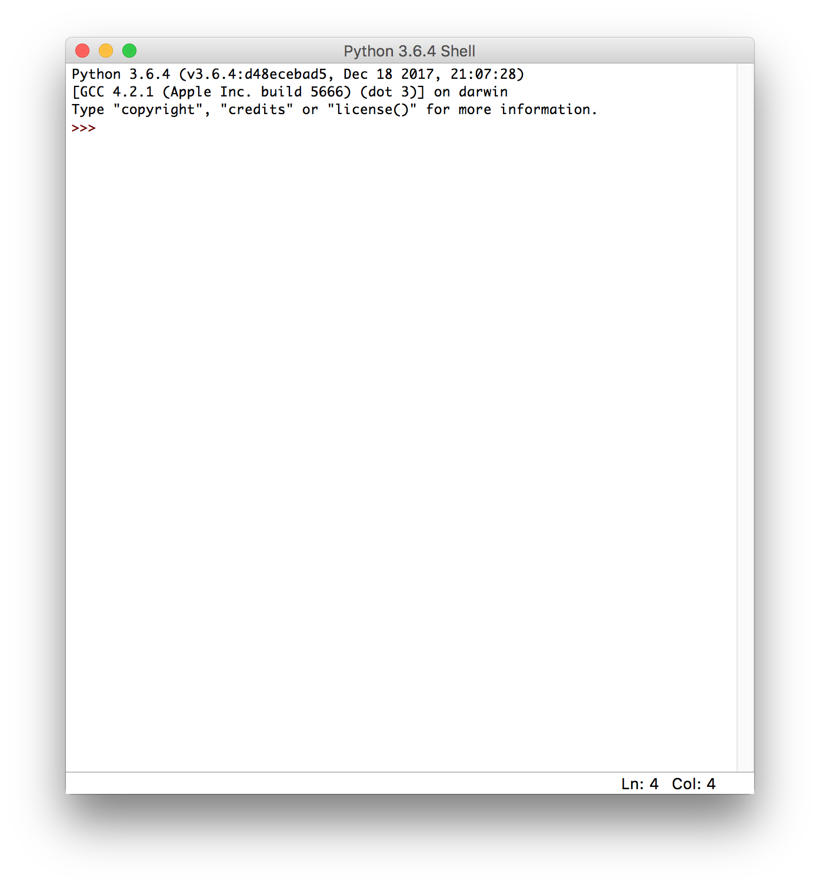

# Lesson 1.1: Setting Up

## 1. Installing Required Components

For this tutorial we will be using Python 3 and the default editor, IDLE. The first thing we will need to do is to install Python.

Head over to https://www.python.org/downloads/ and click **Download Python 3.6.4**.

After clicking the button, we receive an installer file. Open it and follow the instructions on the screen to install Python.

## 2. Starting IDLE

IDLE is the default code editor for Python. You can think of it as a word processor for Python programs. Starting IDLE is a little different depending on which operating system you are using.

If you're on Windows, click the start button in the bottom left corner of your screen and type in `IDLE` and select **IDLE (Python GUI)**.

On macOS (OS X), open Finder, click Applications, double click the folder **Python 3.6**, and open **IDLE**.

On Linux, open a terminal window, type in `idle3`, and press enter.

You should see something open like this:

If you do, we're all set! In the next lesson we will explore the interactive shell.
